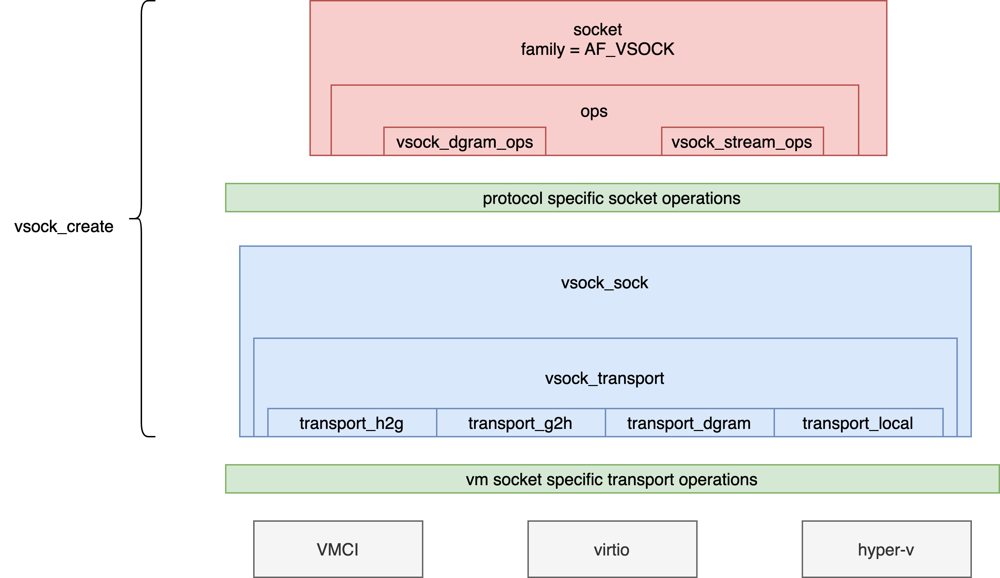
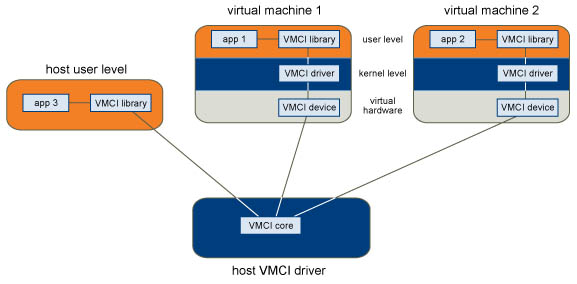
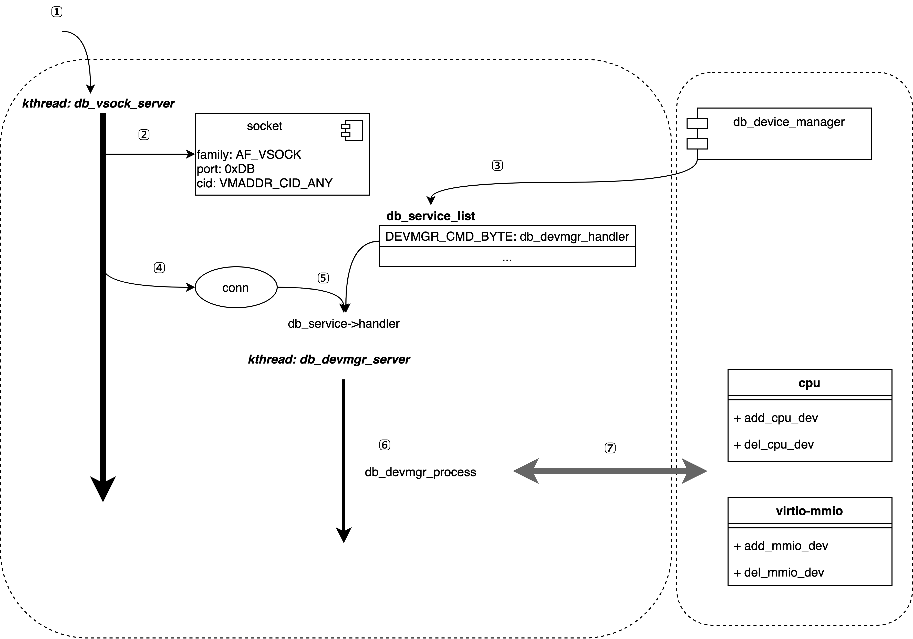

# 虚拟机Guest-Host通信机制系列：vsock，virtio-vsock，upcall之间的关系

# 背景

VM socket（简称vsock）是一种虚拟套接字，用于在不同虚拟机或虚拟机和宿主机之间提供高性能、可靠的通信。vsock内核模块的设计原理如下：
1. 虚拟机与宿主机之间的通信通过一对虚拟套接字进行。这对虚拟套接字的一端在内核中，用于与虚拟机通信；另一端在用户空间中，用于与应用程序通信。
2. vsock内核模块通过VMCI（Virtual Machine Communication Interface）与虚拟机通信，VMCI是一个内核级别的设备，用于在虚拟机和宿主机之间提供高性能、低延迟的通信。
3. vsock内核模块为每个虚拟机分配一个唯一的地址CID（context ID），可以通过CID来区分不同的虚拟机。
4. 在内核中，vsock内核模块将vsock虚拟套接字的数据包封装在VMCI数据包中，并通过VMCI设备与虚拟机通信。
5. 在虚拟机中，vsock内核模块将从VMCI设备接收的数据包解封装，将vsock数据包交给虚拟套接字进行处理。
6. vsock内核模块支持多种传输协议，包括TCP、UDP和RAW。

总之，vsock内核模块通过VMCI提供高性能、低延迟的虚拟机间通信，为虚拟化环境提供了一个快速、可靠的通信机制

# 框架

## 关系图
<p align="center">

</p>

### 初始化
#### VM sock初始化：vsock_init
注册：
1. vsock_device：vsock_device设备提供的一个功能是将cid返回给用户程序。
2. vsock_proto：注册struct vsock_sock结构体。
3. vsock_family_ops：注册了vsock_create函数用于创建AF_VSOCK家族socket。

#### 创建VM socket：vsock_create
构造一个struct socket并初始化好socket的struct proto_ops，指定SOCK_DGRAM还是SOCK_STREAM类型操作：
> SOCK_STREAM: Provides sequenced, reliable, two-way, connection-based byte streams.  An out-of-band data transmission mechanism may be supported.
> 
> SOCK_DGRAM: Supports datagrams (connectionless, unreliable messages of a fixed maximum length).

此外，改过程还初始化了vsock_transport，改结构体是VM socket规定的方法接口，这些方法可以通过VMCI设备、virtio设备以及hyper-v实现。
Transport有4类交互情况：
> VSOCK_TRANSPORT_F_H2G: Transport provides host->guest communication
> 
> VSOCK_TRANSPORT_F_G2H: Transport provides guest->host communication
> 
> VSOCK_TRANSPORT_F_DGRAM: Transport provides DGRAM communication
> 
> VSOCK_TRANSPORT_F_LOCAL: Transport provides local (loopback) communication

这四类情况对应不同的vsock_transport结构，以VMCI为例，它的初始化过程为：

初始化vmci_transport模块：注册vmci_vsock_transport_cb回调函数，该函数在guest或者host激活（active）时调用，该函数的实现为：
```
static void vmci_vsock_transport_cb(bool is_host)
{
	int features;

	if (is_host)
		features = VSOCK_TRANSPORT_F_H2G;
	else
		features = VSOCK_TRANSPORT_F_G2H;

	vsock_core_register(&vmci_transport, features);
}
```
vsock_core_register根据当前的Host/Guest的环境初始化相应的接口结构：
```
int vsock_core_register(const struct vsock_transport *t, int features)
{
	const struct vsock_transport *t_h2g, *t_g2h, *t_dgram, *t_local;
...
	if (features & VSOCK_TRANSPORT_F_H2G) {
		if (t_h2g) {
			err = -EBUSY;
			goto err_busy;
		}
		t_h2g = t;
	}
...
	transport_h2g = t_h2g;
	transport_g2h = t_g2h;
	transport_dgram = t_dgram;
	transport_local = t_local;

err_busy:
...
}
```
这样，在vsock_create初始化transport结构的时候，才能保证相应的结构体不为空。

### VMCI设备
[VMCI](https://www.ntpro.nl/blog/archives/685-Virtual-Machine-Communication-Interface-VMCI.html)（Virtual Machine Communication Interface）是一种VMware虚拟化平台的通信机制，它提供了一种高效可靠的通信方式，允许虚拟机之间、虚拟机与主机之间进行通信。
内核VMCI设备的框架提供了一种直接在内核空间中与VMCI设备进行交互的方法。它包含了以下几个主要组件：
1. VMCI控制器：VMCI控制器负责发现VMCI设备，并为其注册一个设备驱动程序。它提供了VMCI设备管理的基本接口，例如设备注册、设备注销和设备状态查询等。
2. VMCI设备驱动程序：VMCI设备驱动程序是实现VMCI设备的核心组件。它负责处理VMCI设备的I/O请求，将请求转发给相应的处理程序，并将响应返回给请求方。
3. VMCI设备节点：VMCI设备节点是一个内核设备对象，它代表了VMCI设备在内核中的存在。当VMCI设备被注册时，VMCI设备节点会被创建并与VMCI设备进行关联。通过VMCI设备节点，内核VMCI设备框架可以直接与VMCI设备进行交互。
4. VMCI设备文件系统：VMCI设备文件系统是一种特殊的文件系统，它提供了一种用户态访问VMCI设备的方式。当VMCI设备被注册时，VMCI设备文件系统会自动创建一个相应的设备文件，用户可以通过该文件进行VMCI设备的读写操作。
   
总体来说，内核VMCI设备的框架提供了一种高效可靠的VMCI通信方式，使得虚拟机和主机之间的通信更加方便快捷。

<p align="center">

</p>

### virtio-vsock
TODO

### 安全容器upcall设备热插拔技术

在QEMU中，实现对设备的热插拔需要使用ACPI（Advanced Configuration and Power Interface，高级配置与电源管理）模块实现，虚拟化ACPI包含了内核的驱动部分和QEMU的设备模拟部分。而安全容器Kata-containers为了保持轻量级虚拟化，没有实现对ACPI设备的模拟。因此，为了依然能具备设备热插拔功能，Kata-containers开发了upcall技术用于实现VMM对虚拟机的设备热插拔通信，目前代码已经开源，[kernel patch](https://github.com/kata-containers/kata-containers/tree/main/tools/packaging/kernel/patches/5.10.x/dragonball-experimental)。upcall主要设计原理是：（1）将ACPI中与CPU、MMIO设备相关的部分抽出来（其实只有简洁的几个函数），并增加一个divice manager作为Guest内核的驱动设备热插拔部分；（2）封装vsock成upcall server用于Guest和Host交互，控制Guest内device manager驱动进行设备热插拔操作。

<p align="center">

</p>

以下是整个过程：
1. 注册db_vsock_srv，创建db_vsock_server内核线程；
2. db_vsock_server初始化好专用的vm socket套接字，然后进入死循环，等待客户端连接；
3. 注册db_device_manager，在db_vsock_srv中注册一个service和对应的handler函数，即db_devmgr_handler；
4. 当db_vsock_server收到来自VMM的消息时，它会创立一个conn并开始处理；
5. conn根据消息中的cmd类型，调用db_devmgr_handler函数；
6. db_devmgr_handler先创立一个处理线程db_devmgr_server，然后线程根据具体的请求类型解析对应的action，并执行action；
7. 当前的[req：action]对主要是cpu和virtio-iommu的热插拔操作。