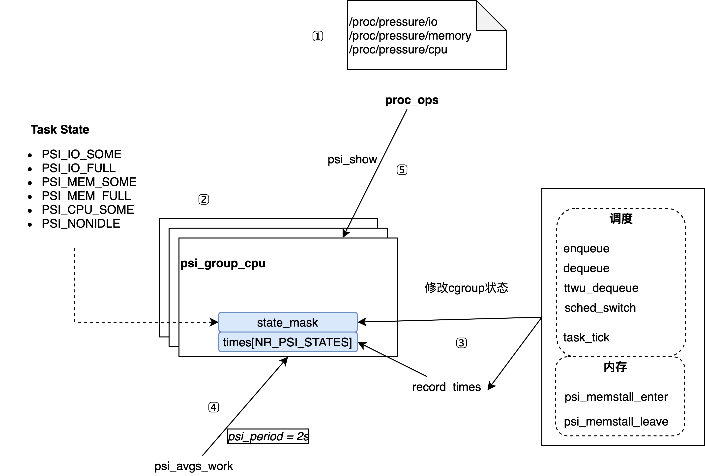

# PSI介绍

# 简介
内核PSI（Pressure Stall Information）是一种通过内核模块实现的压力事件监测技术，它提供了三种压力事件监测：CPU压力、内存压力和IO压力。它提供
整机级别和cgroup级别因资源竞争导致的进程等待时间，从而提供了一种实时检测系统资源竞争程度的方法。

如果你对PSI的基本概念不熟悉，可以查看相关介绍：[Getting Started with PSI](https://facebookmicrosites.github.io/psi/docs/overview)。该文档清晰介绍了PSI的接口以及some和full的含义。另外，想要理解为什么这么设计，可以看一下内核[psi.c](https://elixir.bootlin.com/linux/v5.10/source/kernel/sched/psi.c)文件前的注释部分，几个case阐述了各种阻塞情况下some和full的意义。下面分析一下PSI的实现。

# 源码实现

### 流程图
<p align="center">

</p>

### 流程解析

##### step1
初始化系统级psi三个proc伪文件。psi_proc_init 函数中完成 psi 接口文件节点的创建。这里值得注意的是文件操作接口：

```
static const struct proc_ops psi_io_proc_ops = {
	.proc_open	= psi_io_open,
	.proc_read	= seq_read,
	.proc_lseek	= seq_lseek,
	.proc_write	= psi_io_write,
	.proc_poll	= psi_fop_poll,
	.proc_release	= psi_fop_release,
};
...
static int psi_io_open(struct inode *inode, struct file *file)
{
	return single_open(file, psi_io_show, NULL);
}

```
以IO的文件打开操作为例，最终使用的是psi_io_show函数，这个函数在后续介绍。

##### step2
初始化每个cgroup的统计结构psi_group_cpu和更新统计数据操作执行的周期。系统级别的统计结构全局声明：

```
struct psi_group psi_system = {
	.pcpu = &system_group_pcpu,
};
```
在配置cgroup的情况下`CONFIG_CGROUPS=y`，在创建cgroup的时候做psi cgroup初始化。

##### step3
任务调度以及处理一些IO读写/页回收操作时候，会更新每个任务所在的psi_io_proc_ops的state，并更新对应state的时间。cpu和io的压力走调度的逻辑就可以统计了，关键看一下内存压力的统计逻辑。

psi_memstall_enter函数是Linux内核中用于记录内存压力的函数，它会在内核中的一些关键位置被调用，例如：
* 在内存分配函数__alloc_pages_slowpath中，当内存不足时会调用psi_memstall_enter函数记录内存压力。
* 在内核线程kswapd中，当系统内存不足时会调用psi_memstall_enter函数记录内存压力。
* 在内存压缩函数kcompactd_do_work执行前，调用psi_memstall_enter函数记录内存压力。

psi_memstall_enter函数会在内存不足时的关键位置被调用，选取哪些位置来采集比较细节了。

##### step4
psi_avgs_work周期性地执行，执行周期设置为2s。每次执行时候计算10s、60s、300s内各类资源导致stall的时间平均值，有意思的是平均值的计算方式。它使用与负载load平均值计算方法一样的[一次指数平滑法](https://javaforall.cn/194528.html)。

```
#define EXP_10s		1677		/* 1/exp(2s/10s) as fixed-point */
#define EXP_60s		1981		/* 1/exp(2s/60s) */
#define EXP_300s	2034		/* 1/exp(2s/300s) */

static void calc_avgs(unsigned long avg[3], int missed_periods,
		      u64 time, u64 period)
{
...
	/* Sample the most recent active period */
	pct = div_u64(time * 100, period);
	pct *= FIXED_1; // FIXED_1 = (1 << 11)
	avg[0] = calc_load(avg[0], EXP_10s, pct);
	avg[1] = calc_load(avg[1], EXP_60s, pct);
	avg[2] = calc_load(avg[2], EXP_300s, pct);
}

...

/*
 * a1 = a0 * e + a * (1 - e)
 */
static inline unsigned long
calc_load(unsigned long load, unsigned long exp, unsigned long active)
{
	unsigned long newload;

	newload = load * exp + active * (FIXED_1 - exp);
	if (active >= load)
		newload += FIXED_1-1;

	return newload / FIXED_1;
}

```

##### step5
访问pressure文件时调用psi_show函数，psi_show实际上是根据4中算出的avg[3]输出得到。

### 其他
本文只关注psi指标的意义，没有分析psi的trigger流程了。简单介绍一下，trigger是指一个阈值，当系统中特定类型的阻塞事件超过该阈值时，PSI会记录一条事件，并将其报告给用户或监控系统。trigger可以用于确定系统中发生阻塞的原因，找出引起性能问题的瓶颈，并采取相应的措施来优化系统性能。